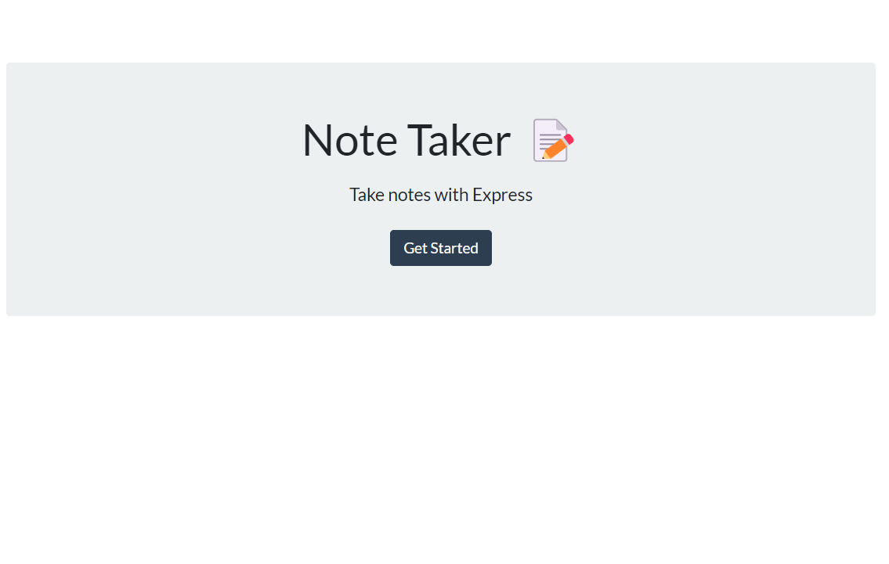

<h1 align="center">UofU-Note Taker</h1>
  
## Description
As a small business owner,   I want to be able to write and save notes,   So that I can organize my thoughts and keep track of tasks I need to complete.
## Table of Contents
- [Description](#description)
- [Installation](#installation)
- [Usage](#usage)
- [License](#license)
- [Contributing](#contributing)
- [Tests](#tests)
- [Questions](#questions)
## Installation

## Usage
GIVEN a note-taking application 
WHEN I open the Note Taker 
THEN I am presented with a landing page with a link to a notes page 
WHEN I click on the link to the notes page 
THEN I am presented with a page with existing notes listed in the left-hand column, plus empty fields to enter a new note title and the note’s text in the right-hand column 
WHEN I enter a new note title and the note’s text 
THEN a Save icon appears in the navigation at the top of the page 
WHEN I click on the Save icon 
THEN the new note I have entered is saved and appears in the left-hand column with the other existing notes 
WHEN I click on an existing note in the list in the left-hand column 
THEN that note appears in the right-hand column 
WHEN I click on the Write icon in the navigation at the top of the page 
THEN I am presented with empty fields to enter a new note title and the note’s text in the right-hand column 
## License

## Contributing
chigley22, and UofU starter code

## Mock-Up

## Tests

## Questions
GitHub: [chigley22](https://github.com/chigley22)   
Feel free to email me with any questions: cman_hig@hotmail.com
